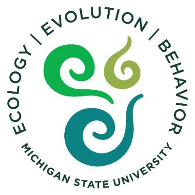

## Jenna Baljunas 

:::: {.columns .transect-layout}

::: {.column .left-panel}

::: {.text-center}
{width="70%"}

:::

:::

::: {.column .right-panel}

Hi! This project is part of my PhD dissertation at Michigan State University. There, I am part of the Department of Integrative Biology and Ecology, Evolution, & Behavior Program through the [Spatial and Community Ecology (SpaCE) Lab](https://www.communityecologylab.com/), led by Dr. Phoebe Zarnetske.

  

  

:::

::::