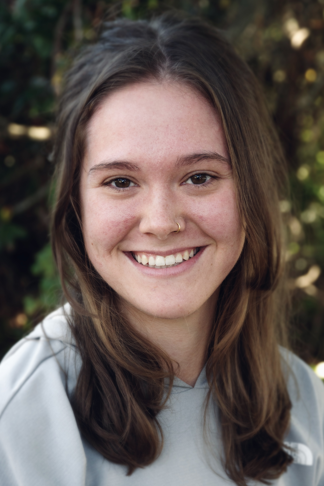

## Jenna Baljunas 

:::: {.columns}

::: {.column width="30%"}
{width="90%"}
:::

::: {.column width="70%"}

Hi! This project is part of my PhD dissertation at Michigan State University. There, I am part of the Department of Integrative Biology and Ecology, Evolution, & Behavior Program through the [Spatial and Community Ecology (SpaCE) Lab](https://www.communityecologylab.com/), lead by Dr. Phoebe Zarnetske.